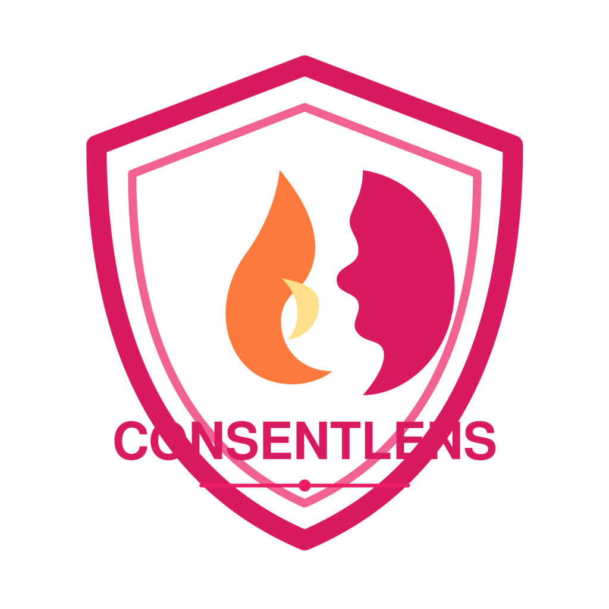
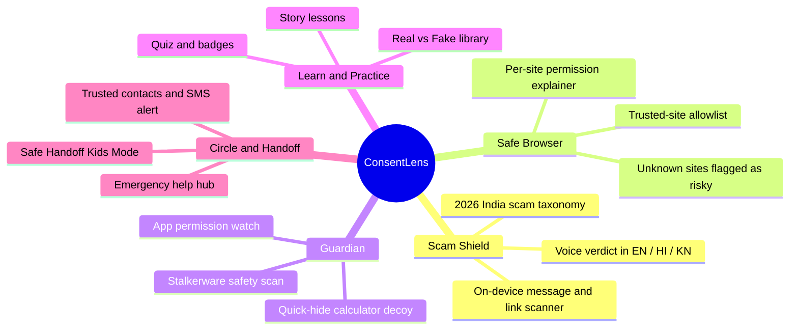
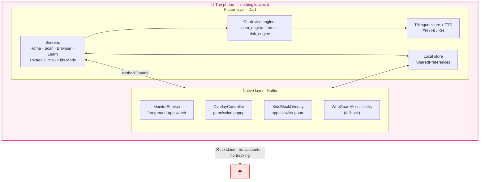
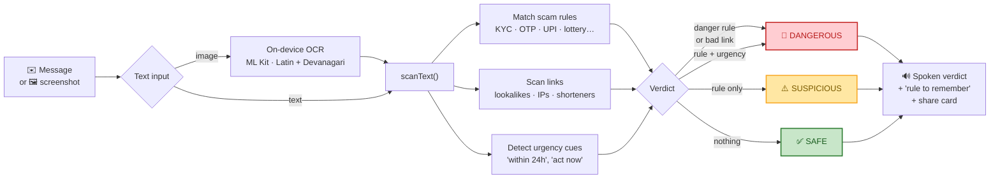
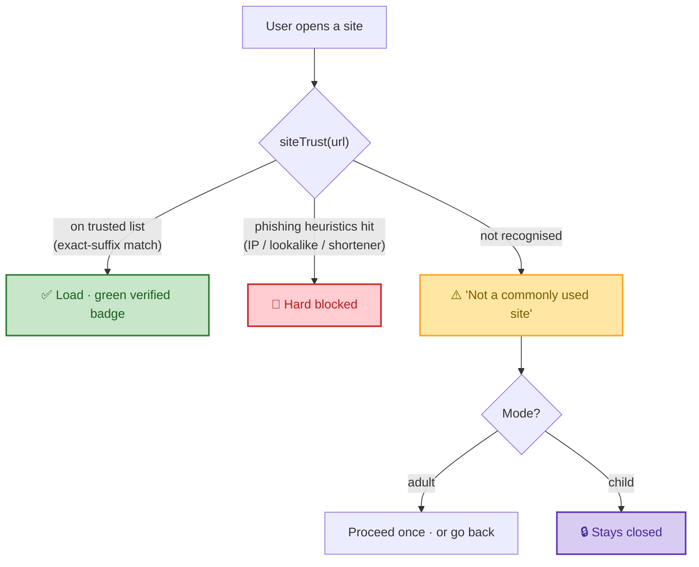
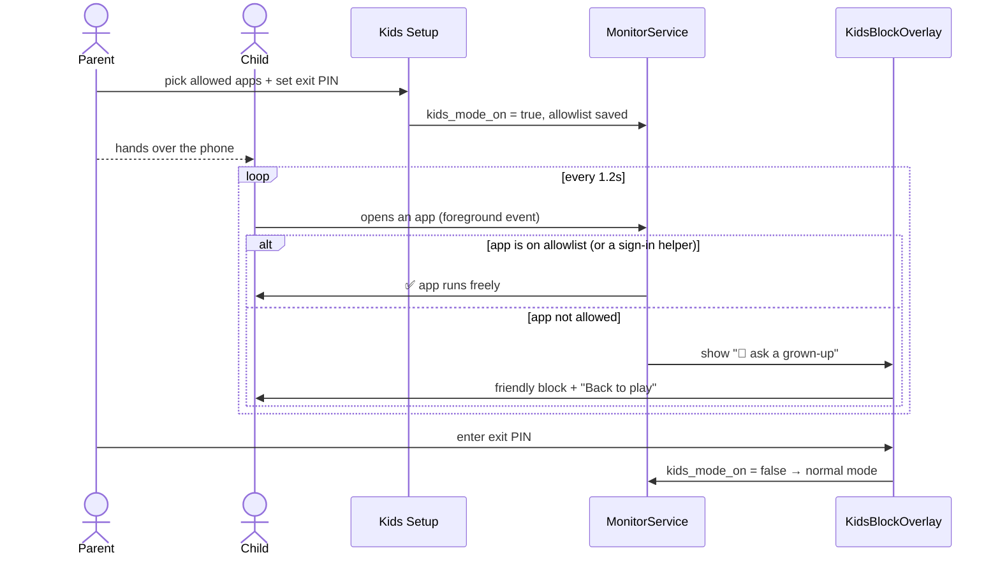
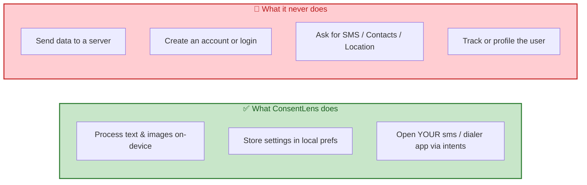

<div align="center">



# ConsentLens

### Safe Digital Onboarding Kit for First-Time Women Internet Users

**SheSafe Hackathon · RVCE Women in Cloud × DSCI · Team MPOWERNET**

[](#)
[](#)
[](#)
[](#)

*Spot the scam. Browse safe. Hand the phone over without fear.*

</div>

---

## 🌸 Why ConsentLens

Millions of women come online for the first time every year — through a first smartphone, a first UPI app, a first WhatsApp forward. They are the **prime target** for KYC fraud, "digital arrest" calls, lottery scams, stalkerware, and permission-hungry apps.

ConsentLens is a calm, friendly guardian that **explains risk in plain language and the user's own voice** — and does it **entirely on the phone**. No cloud, no accounts, no tracking. Your messages and screenshots never leave the device.

> **Design promise:** flag and *inform*, never accuse or auto-act. On stalkerware we never say "just uninstall" — removal can alert an abuser. We say *document first, then get help.*

---

## ✨ The Five Pillars



| Pillar | What it does | Privacy stance |
|---|---|---|
| 🛡️ **Scam Shield** | Paste any SMS/link → instant `SAFE / SUSPICIOUS / DANGEROUS` verdict with a spoken explanation | Rule engine runs locally — works in airplane mode |
| 🌐 **Safe Browser** | Built-in browser where only **commonly-used sites** load freely; unknown ones are flagged as possibly fraudulent | No browsing history leaves the device |
| 🔎 **Guardian** | Watches permissions of every app you open, scans for spyware, hides the app behind a calculator on a long-press | All scans on-device |
| 🎓 **Learn & Practice** | Cartoon-free emoji stories, a Real-vs-Fake gallery, a quiz, and earnable badges | No analytics |
| 🤝 **Circle & Handoff** | Add 1–2 trusted people (no contacts permission), one-tap SMS alert, and a parent-controlled Kids Mode | No SMS permission — uses the user's own SMS app |

---

## 🏗️ Architecture at a glance

ConsentLens is a **Flutter UI** over a **native Kotlin safety layer**, talking through a `MethodChannel`. Everything in the diagram below runs on the phone — there is no server.



---

## 🛡️ How the Scam Scanner thinks

A pasted message (or text read from a screenshot via on-device OCR) flows through a rule engine built from the **2026 India scam taxonomy** — KYC/Aadhaar blocks, "digital arrest", UPI refund-PIN traps, lottery/KBC, fake couriers, job-fee scams — plus urgency cues and suspicious-link heuristics.



---

## 🌐 Safe Browser — an allowlist, not a blocklist

Most filters block *known-bad* sites and miss everything new. ConsentLens flips it: a curated list of **~110 commonly-used India domains** (banks, UPI, `gov.in`, top shopping/news/social) load freely; **anything else is treated as potentially fraudulent** until the user consciously continues. In child mode, unknown sites simply stay closed.



> Ride-along tricks like `google.com.evil.in` or `fakeflipkart.com` are rejected — matching is exact-label suffix only, covered by unit tests.

---

## 🧸 Safe Handoff — parent-controlled Kids Mode

The parent picks exactly which apps the child may open and sets a 4-digit exit PIN. While Kids Mode is on, the foreground app is watched; anything outside the allowlist is covered by a friendly *"ask a grown-up"* screen. Sign-in helpers (Google Play Services) and the dialer are never blocked, so the experience stays smooth and emergency calls remain possible.



> **Honest scope:** without device-owner enrollment this is a strong *deterrent*, not an unbreakable kiosk — the same non-root ceiling consumer parental apps hit.

---

## 🔐 Privacy by construction



**Permissions used (and why):** overlay (permission popups & kids guard) · usage-access (which app is open) · notifications (foreground service) · biometric (adult/child verify). **No** SMS, Contacts, Camera, or Location permission.

---

## 📂 Project layout

```
lib/
├── main.dart                 # app + overlay entrypoints
├── logic/
│   ├── scam_engine.dart      # 🛡️ on-device scam taxonomy + verdict
│   ├── threat.dart           # 🌐 domain heuristics + trusted-site allowlist
│   ├── learn_content.dart    # 🎓 lessons, quiz, badges, scam library
│   ├── i18n.dart             # 🗣️ EN/HI/KN strings + TTS locales
│   ├── store.dart            # 💾 shared prefs (also read by Kotlin)
│   └── native.dart           # 🔌 MethodChannel bridge
├── screens/                  # home · scan · safe_browser · learn_zone
│                             # trusted_circle · kids_mode · emergency_hub
└── widgets/                  # design system + quick-hide decoy
android/app/src/main/kotlin/com/consentlens/consentlens/
├── MonitorService.kt         # foreground-app watch + kids gate
├── OverlayController.kt      # permission popup (2nd Flutter engine)
├── KidsBlockOverlay.kt       # native kids "ask a grown-up" guard
└── MainActivity.kt           # channel handlers
test/
└── logic_test.dart           # 35 unit tests (scam, threat, allowlist, i18n)
```

---

## 🚀 Build & run

```bash
flutter pub get
flutter test                       # 35 unit tests
flutter build apk --release        # → build/app/outputs/flutter-apk/
```

A ready-to-install build for the team lives at **`APKforTeamate/ConsentLens.apk`** (universal: arm64 + arm32 + x86_64, minSdk 26).

**On a Samsung/Oppo phone:** allow "install from this source" → tap *Install anyway* past Play Protect → set the app's Battery to **Unrestricted** so the guardian service survives.

---

<div align="center">

Made with 💗 for first-time women internet users · **100% on your phone**

</div>
